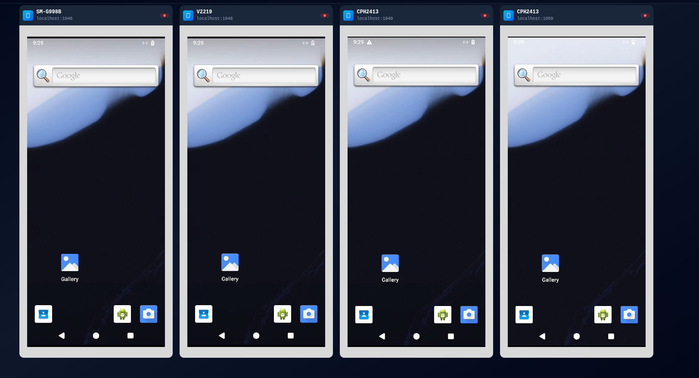

# remote-scrcpy



Web-based remote control for Android devices powered by scrcpy.

## Author

**trinhminhieu**

## Description

remote-scrcpy is a web client for [Genymobile/scrcpy](https://github.com/Genymobile/scrcpy) that enables remote Android device control through a web browser. It provides smooth H.264 video streaming with low latency and full device interaction capabilities.

## Features

- **Real-time Screen Mirroring**: Smooth H.264 video streaming with multiple decoder options
- **Full Device Control**: Touch, swipe, keyboard input, and more
- **Multiple Decoder Support**:
  - H264 Converter (MSE Player) - Best quality, 60fps
  - Broadway.js - Software decoder with WebAssembly
  - Tiny H264 - Lightweight software decoder
  - WebCodecs - Hardware-accelerated decoding (Chrome/Edge)
- **Web-based Interface**: No client installation required
- **Low Latency**: Optimized for real-time interaction
- **Multi-device Support**: Control multiple Android devices simultaneously

## Requirements

### Browser
- WebSockets support
- Media Source Extensions and H.264 decoding
- WebWorkers
- WebAssembly

### Server
- Node.js v20+
- node-gyp ([installation guide](https://github.com/nodejs/node-gyp#installation))
- `adb` executable in PATH

### Android Device
- Android 5.0+ (API 21+)
- [ADB debugging enabled](https://developer.android.com/studio/command-line/adb.html#Enabling)
- [Additional option](https://github.com/Genymobile/scrcpy/issues/70#issuecomment-373286323) may be required for keyboard/mouse control

## Installation

### From npm (Recommended)

```bash
# Install globally
npm install -g remote-scrcpy

# Run
remote-scrcpy
```

### From source

```bash
# Clone the repository
git clone https://github.com/trinhminhieu/remote-scrcpy.git
cd remote-scrcpy

# Install dependencies
npm install

# Build and start
npm start
```

The server will start on `http://localhost:8000`

## Usage

1. Connect your Android device via ADB:
   ```bash
   adb connect <device-ip>:5555
   ```

2. Open your browser and navigate to `http://localhost:8000`

3. Select your device from the list

4. Choose a video decoder (H264 Converter recommended for best quality)

5. Start controlling your device!

## Configuration

You can customize the build by editing `build.config.override.json`:

```json
{
  "INCLUDE_GOOG": true,
  "USE_H264_CONVERTER": true,
  "USE_BROADWAY": true,
  "USE_TINY_H264": true,
  "USE_WEBCODECS": true
}
```

## Development

```bash
# Development build with hot reload
npm run dist:dev

# Production build
npm run dist:prod
```

## Architecture

remote-scrcpy consists of:
- **Frontend**: React-based web interface with video decoders
- **Backend**: Node.js server with WebSocket support
- **scrcpy**: Modified version with WebSocket integration

## Security Notice

⚠️ **Important Security Considerations:**
- No encryption between browser and server by default
- No authorization mechanism
- Suitable for local network use only
- For production use, configure HTTPS and implement authentication

## Credits

Based on [ws-scrcpy](https://github.com/NetrisTV/ws-scrcpy) by NetrisTV

Original [scrcpy](https://github.com/Genymobile/scrcpy) by Genymobile

## License

See [LICENSE](./LICENSE) file for details.

## Contributing

Contributions are welcome! Please feel free to submit a Pull Request.

## Support

For issues and questions, please open an issue on GitHub.

---

**Author**: trinhminhieu  
**Project**: remote-scrcpy  
**Year**: 2026
